

    
    <h1 align="center">Fonts for Discord</h1>

## A shrimple Discord Font repository for themers who wants to use custom fonts in their themes.
## All Fonts will be provided in here along with a Gallery section that will showcase each fonts in a neat & organised manner.
>[!NOTE]
>BlowBrush, Evolve Sans, Almarai, Witcher Handwriting & few other fonts doesn't seem to have a family tree like other fonts so I renamed the orginal regular font file into others to make them work, all theme makers are advised to just use the given theme files for all types of fonts in their themes accordingly, let me know if you find any family tree for these fonts.
<h1 align="center">Gallery</h1>
<h2 align="left">1. Almarai</h2>
<h2>

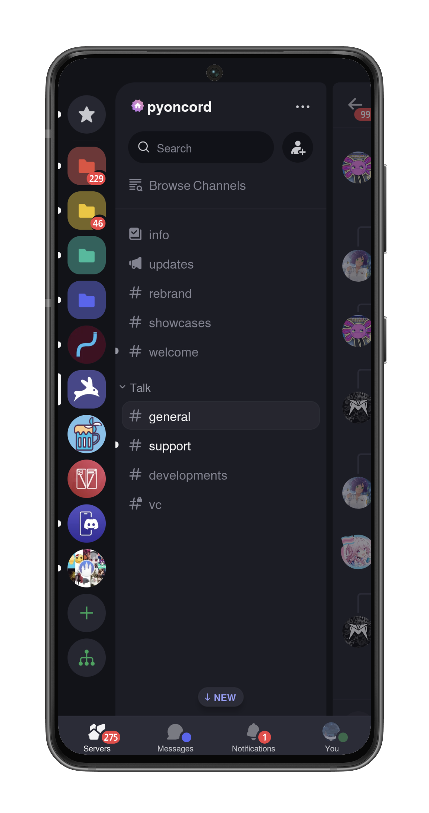

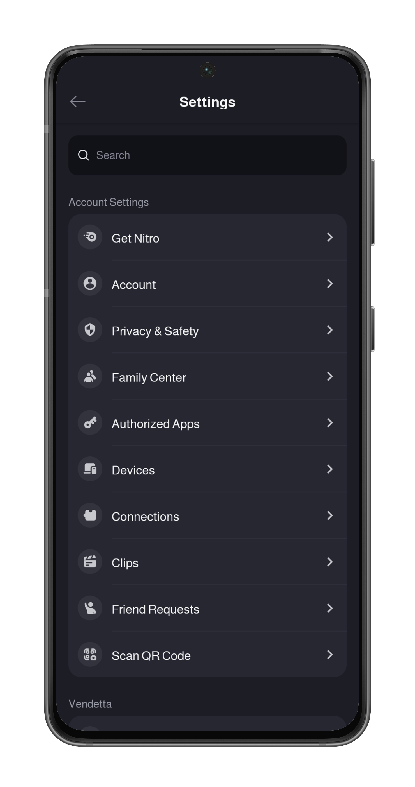

</h2>

## [Font Snippet](https://raw.githubusercontent.com/Rairof/Theme-Fonts/main/Almarai/Almarai-font-snippet.json)
## Font sourced from [here.](https://fonts.google.com/specimen/Almarai?icon.set=Material+Symbols&category=Sans+Serif)
<h2 align="left">2. Cabin</h2>
<h2>

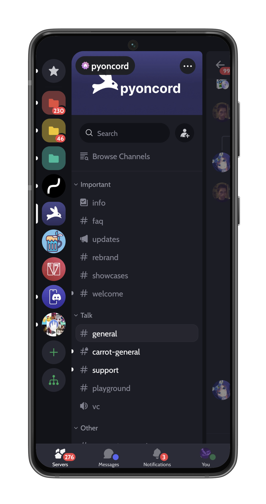

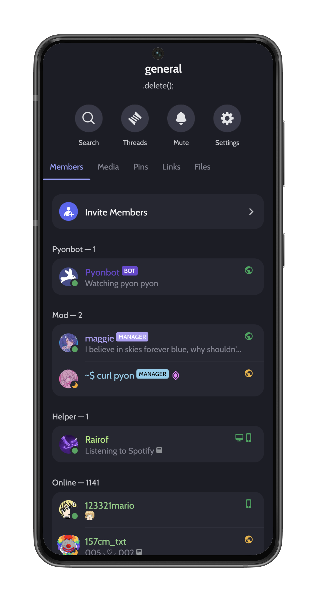

</h2>

## [Font Snippet](https://raw.githubusercontent.com/Rairof/Theme-Fonts/main/Cabin/Cabin-font-snippet.json)
## Font sourced from [here.](https://fonts.google.com/specimen/Cabin)
<h2 align="left">3. Evolve Sans EVO</h2>
<h2>

</h2>

## [Font Snippet](https://raw.githubusercontent.com/Rairof/Theme-Fonts/main/Evolve-Sans-EVO/Evolve-Sans-EVO-font-snippet.json)
## Font sourced from [here.](https://www.dafont.com/made-evolve-sans.font)
<h2 align="left">4. Fira Code</h2>
<h2>

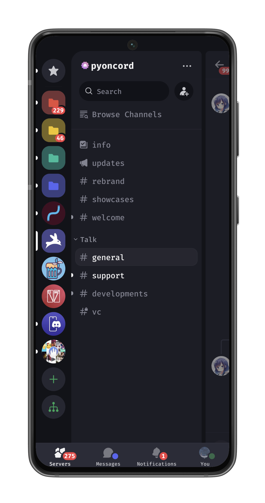

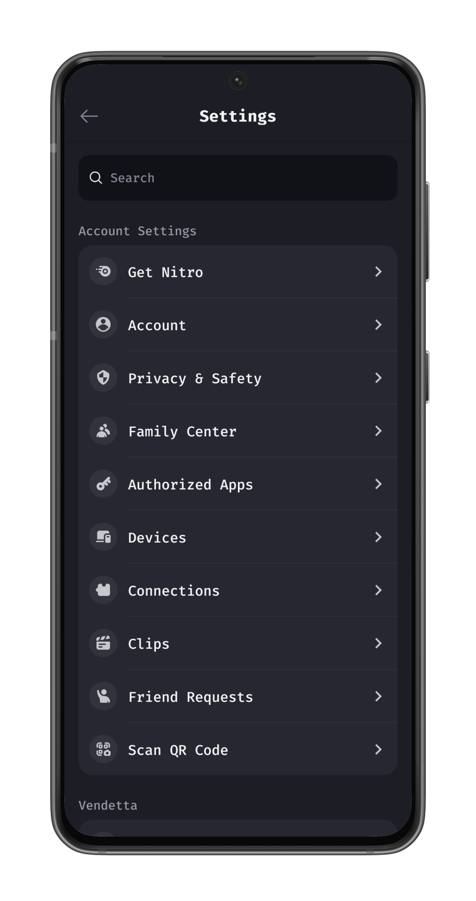

</h2>

## [Font Snippet](https://raw.githubusercontent.com/Rairof/Theme-Fonts/main/Fira-Code/Fira-Code-font-snippet.json)
## Font sourced from [here.](https://fonts.google.com/specimen/Fira+Code?icon.set=Material+Symbols&category=Sans+Serif&subset=latin&noto.script=Latn&classification=Monospace)
<h2 align="left">5. Gantari</h2>
<h2>

</h2>

## [Font Snippet](https://raw.githubusercontent.com/Rairof/Theme-Fonts/main/Gantari/Gantari-font-snippet.json)
## Font sourced from [here.](https://fonts.google.com/specimen/Gantari?icon.set=Material+Symbols&category=Sans+Serif&subset=latin&noto.script=Latn&stroke=Sans+Serif)
<h2 align="left">6. Golos Text</h2>
<h2>

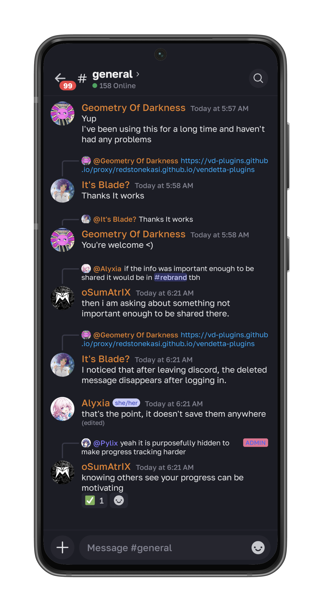

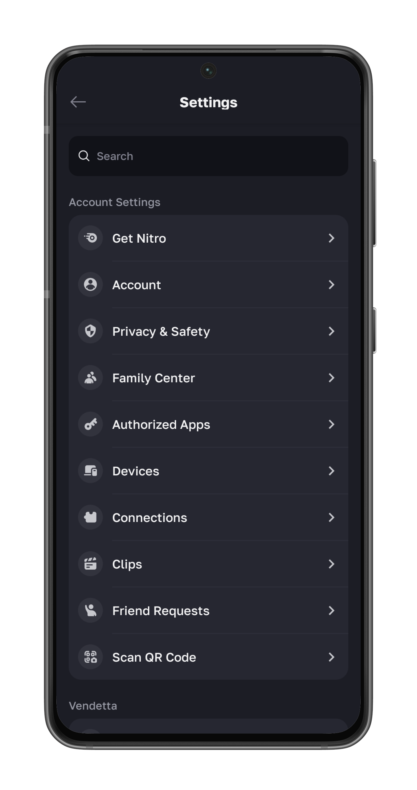

</h2>

## [Font Snippet](https://raw.githubusercontent.com/Rairof/Theme-Fonts/main/Golos-Text/Golos-Text-font-snippet.json)
## Font sourced from [here.](https://fonts.google.com/specimen/Golos+Text?icon.set=Material+Symbols&category=Sans+Serif&subset=latin&noto.script=Latn)
<h2 align="left">7. GoogleSans</h2>
<h2>

</h2>

## [Font Snippet](https://raw.githubusercontent.com/Rairof/Theme-Fonts/main/GoogleSans/GoogleSans-font-snippet.json)
## Font sourced from [here.](https://github.com/hprobotic/Google-Sans-Font)
<h2 align="left">8. IBM Plex Mono</h2>
<h2>

</h2>

## [Font Snippet](https://raw.githubusercontent.com/Rairof/Theme-Fonts/main/IBM_Plex_Mono/ibm_flex_mono.json)
## [Font Theme Snippet](https://raw.githubusercontent.com/Rairof/Theme-Fonts/main/IBM_Plex_Mono/IBM_Theme.json)
## Font sourced from [here.](https://fonts.google.com/specimen/IBM+Plex+Mono)
<h2 align="left">9. InstrumentSans</h2>
<h2>

</h2>

## [Font Snippet](https://raw.githubusercontent.com/Rairof/Theme-Fonts/main/InstrumentSans/InstrumentSans-font-snippet.json)
## Font sourced from [here.](https://fonts.google.com/specimen/Instrument+Sans?query=sans&subset=latin&noto.script=Latn)
<h2 align="left">10. Inter</h2>
<h2>

</h2>

## [Font Snippet](https://raw.githubusercontent.com/Rairof/Theme-Fonts/main/Inter/Inter-font-snippet.json)
## Font sourced from [here.](https://fonts.google.com/specimen/Inter?category=Monospace&icon.set=Material+Symbols&query=inter)
<h2 align="left">11. JetBrains Mono</h2>
<h2>

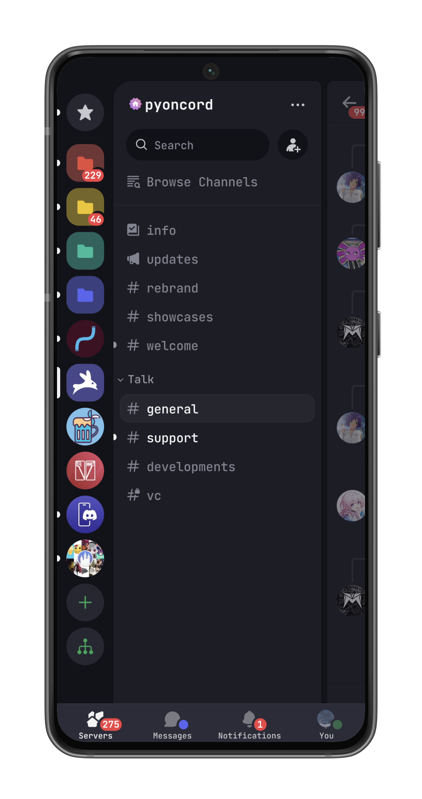
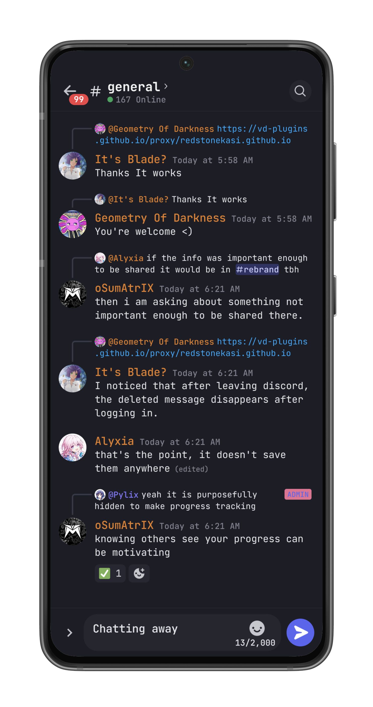

</h2>

## [Font Snippet](https://raw.githubusercontent.com/Rairof/Theme-Fonts/main/JetBrainsMono/JetBrainsMono-font-snippet.json)
## Font sourced from [here.](https://fonts.google.com/specimen/JetBrains+Mono?icon.set=Material+Symbols&category=Sans+Serif&subset=latin&noto.script=Latn&query=Jetbrains+mono)
<h2 align="left">12. Linotte</h2>
<h2>

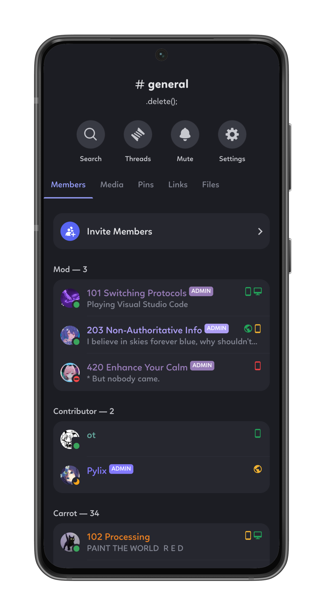

</h2>

## [Font Snippet](https://raw.githubusercontent.com/Rairof/Theme-Fonts/main/Linotte/Linotte-font-snippet.json)
## Font sourced from [here.](https://www.joelcarrouche.com/fonts/linotte)
<h2 align="left">13. Meloso</h2>
<h2>

</h2>

## [Font Snippet](https://raw.githubusercontent.com/Rairof/Theme-Fonts/main/Meloso/Meloso-font-snippet.json)
## Font sourced from [here.](https://www.ios-repo-updates.com/repository/alo-s-repo/package/works.alo.fonts.meloso80/)
<h2 align="left">14. Mikhak</h2>
<h2>

</h2>

## [Font Snippet](https://raw.githubusercontent.com/Rairof/Theme-Fonts/main/Mikhak/Mikhak-font-snippet.json)
## Font sourced from [here.](https://fontesk.com/mikhak-typeface/)
<h2 align="left">15. OpenDyslexic</h2>
<h2>

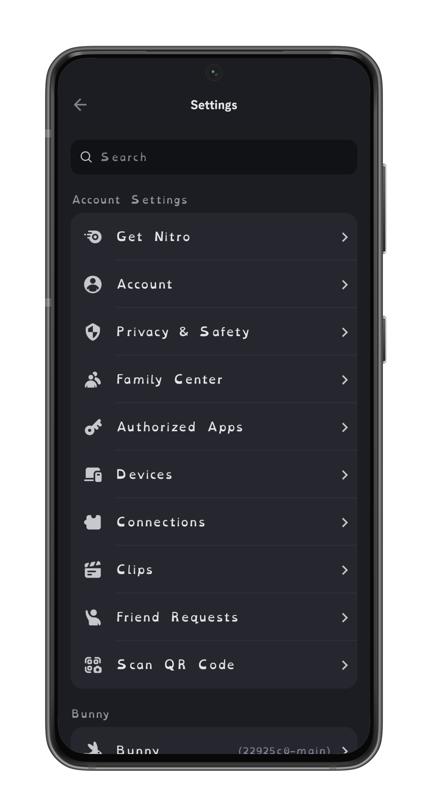

</h2>

## [Font Snippet](https://raw.githubusercontent.com/Rairof/Theme-Fonts/main/OpenDyslexic/OpenDyslexic-font-snippet.json)
## Font sourced from [here.](https://www.dafontfree.io/trakya-sans-serif-font/)
<h2 align="left">16. Playfair</h2>
<h2>

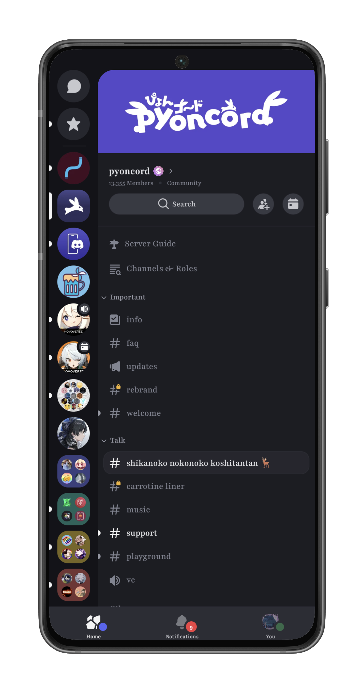
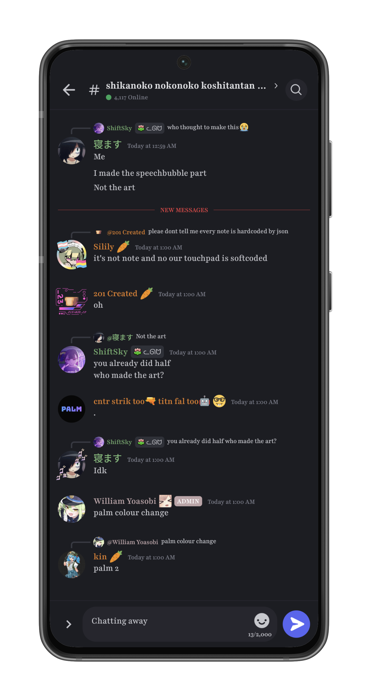
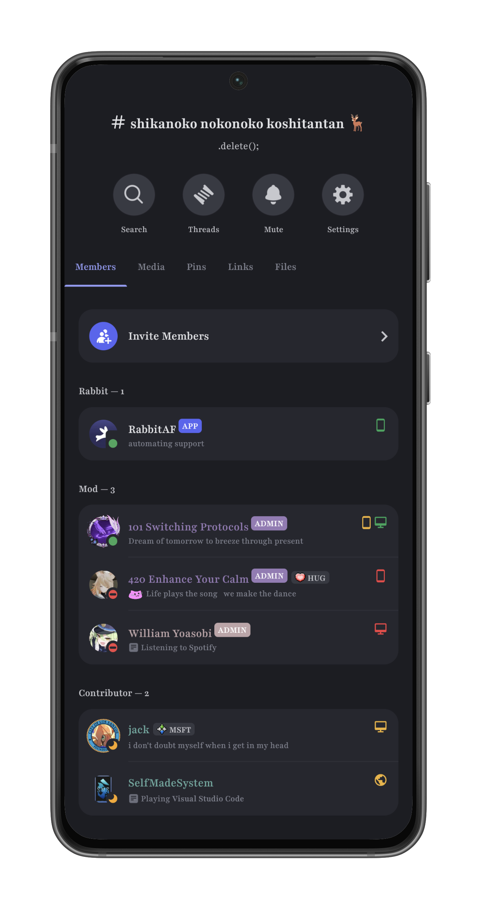

</h2>

## [Font Snippet](https://raw.githubusercontent.com/Rairof/Theme-Fonts/main/Playfair/Playfair-font-snippet.json)
## Font sourced from [here.](https://fonts.google.com/specimen/Playfair)
<h2 align="left">17. Quicksand</h2>
<h2>

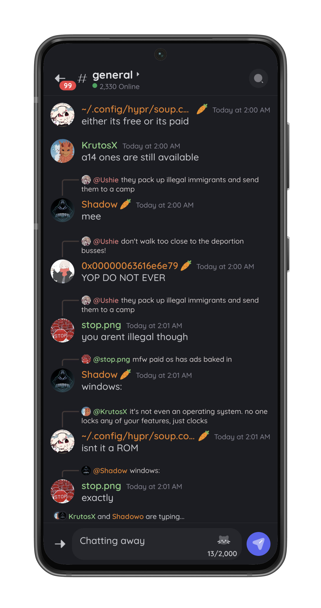

</h2>

## [Font Snippet](https://raw.githubusercontent.com/Rairof/Theme-Fonts/main/Quicksand/Quicksand-font-snippet.json)
## Font sourced from [here.](https://fonts.google.com/specimen/Quicksand)
<h2 align="left">18. San Francisco Pro Display</h2>
<h2>

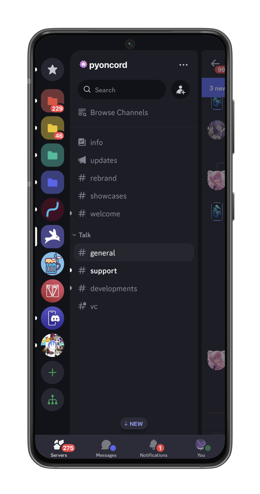

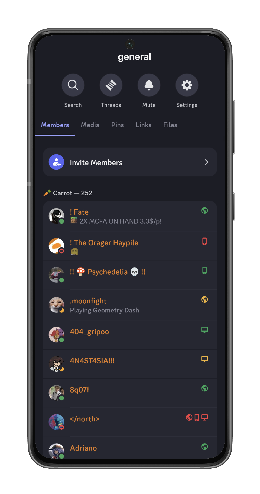

</h2>

## [Font Snippet](https://raw.githubusercontent.com/Rairof/Theme-Fonts/main/SF-Pro-Display/SF-Pro-Display-font-snippet.json)
## Font sourced from [here.](https://online-fonts.com/fonts/san-francisco-pro-display)
<h2 align="left">19. Source Code Pro</h2>
<h2>

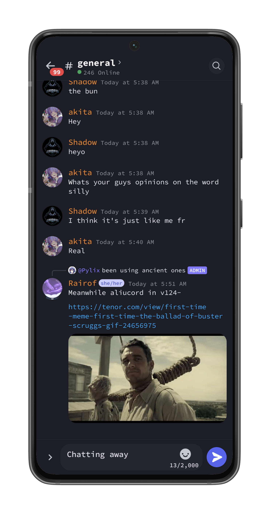

</h2>

## [Font Snippet](https://raw.githubusercontent.com/Rairof/Theme-Fonts/main/Source-Code-Pro/Source-Code-Pro-font-snippet.json)
## Font sourced from [here.](https://fonts.google.com/specimen/Source+Code+Pro?icon.set=Material+Symbols&category=Sans+Serif&subset=latin&noto.script=Latn&classification=Monospace&query=Source+code+pro)
<h2 align="left">20. Space Mono</h2>
<h2>

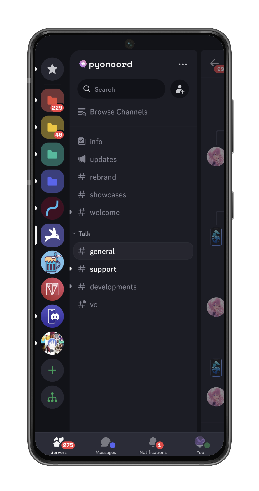
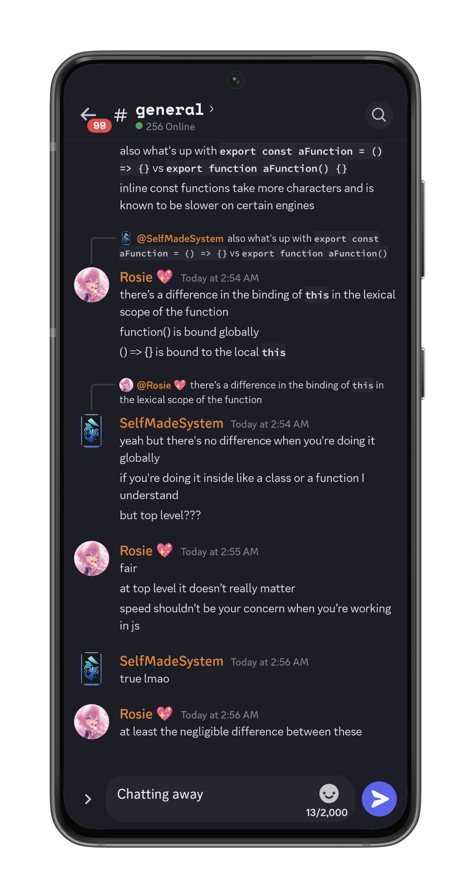

</h2>

## [Font Snippet](https://raw.githubusercontent.com/Rairof/Theme-Fonts/main/Space-Mono/Space-Mono-font-snippet.json)
## Font sourced from [here.](https://fonts.google.com/specimen/Space+Mono?icon.set=Material+Symbols&category=Sans+Serif&subset=latin&noto.script=Latn&query=Space+mono)
<h2 align="left">21. Trakya</h2>
<h2>

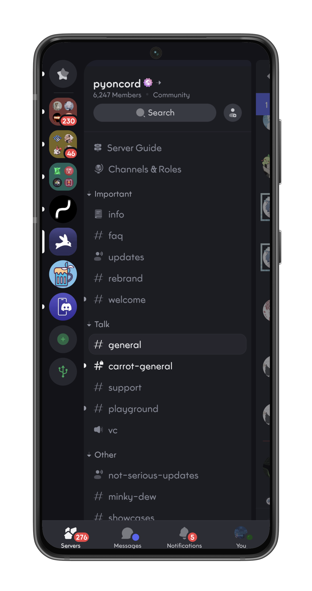
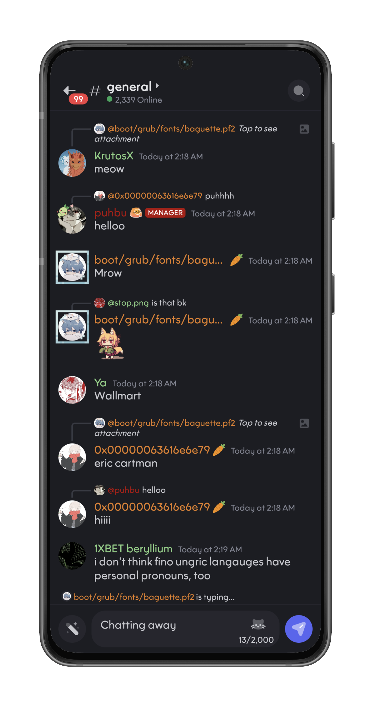

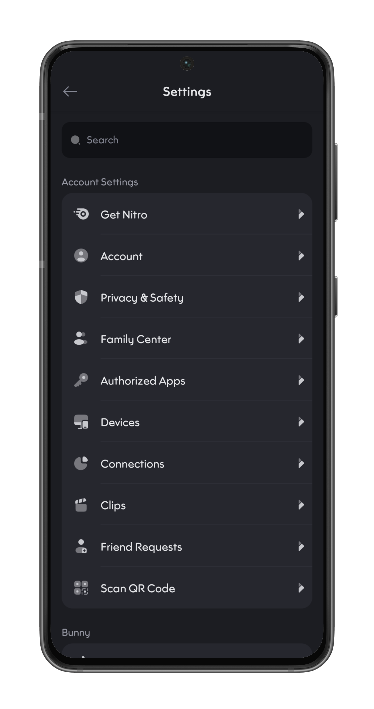

</h2>

## [Font Snippet](https://raw.githubusercontent.com/Rairof/Theme-Fonts/main/Trakya/Trakya-font-snippet.json)
## Font sourced from [here.](https://www.dafontfree.io/trakya-sans-serif-font/)
<h2 align="left">22. Ubuntu Sans Mono</h2>
<h2>

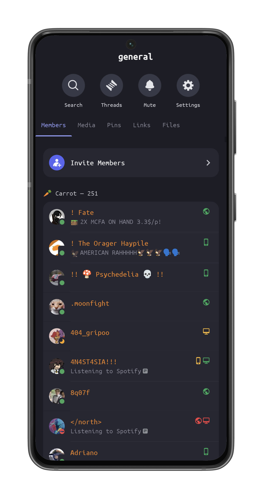

</h2>

## [Font Snippet](https://raw.githubusercontent.com/Rairof/Theme-Fonts/main/Ubuntu-Mono/Ubuntu-Mono-font-snippet.json)
## Font sourced from [here.](https://fonts.google.com/specimen/Ubuntu+Sans+Mono)
# Implementation of said fonts are described in [here](https://github.com/Rairof/Theme-Fonts/blob/main/assets/Implementation.md) (OUTDATED NOW!)
