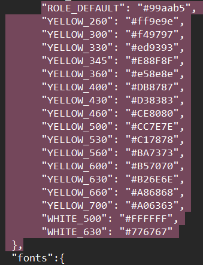
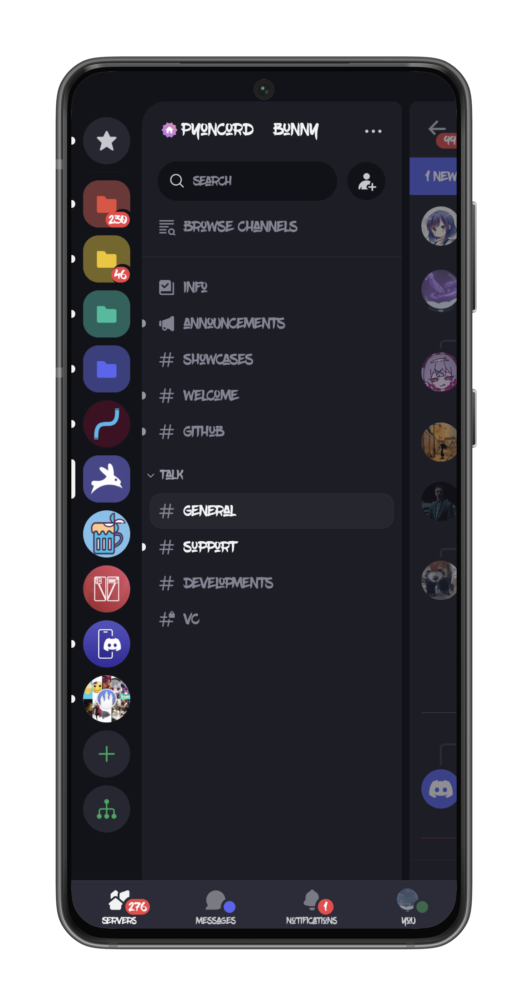
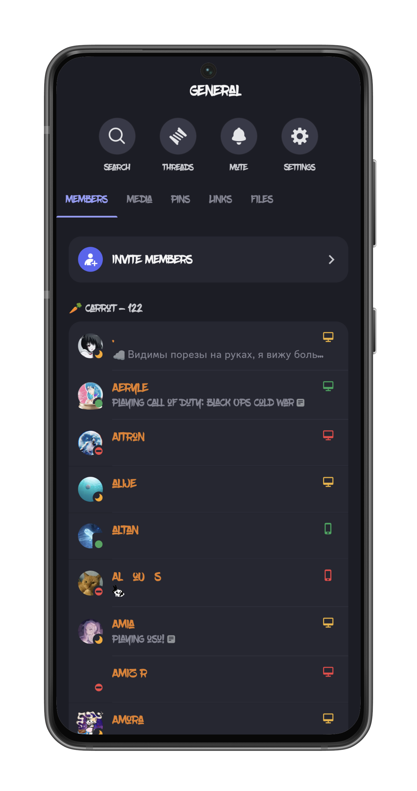
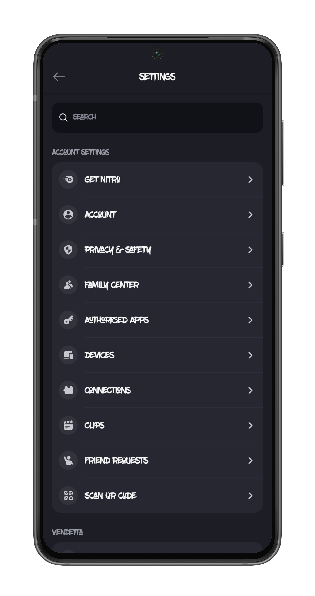
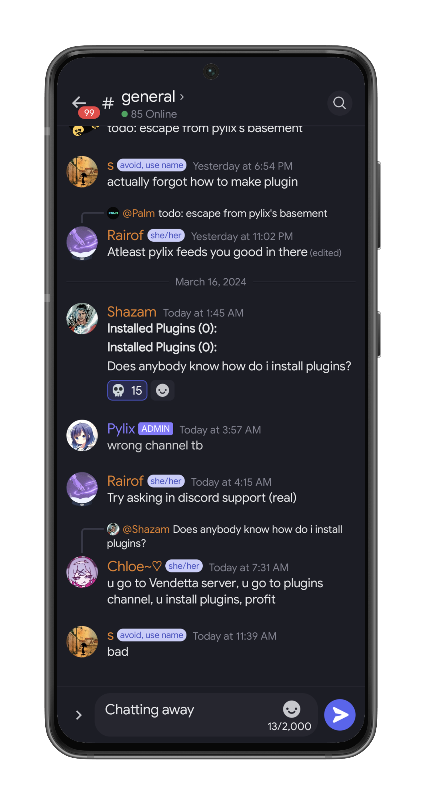
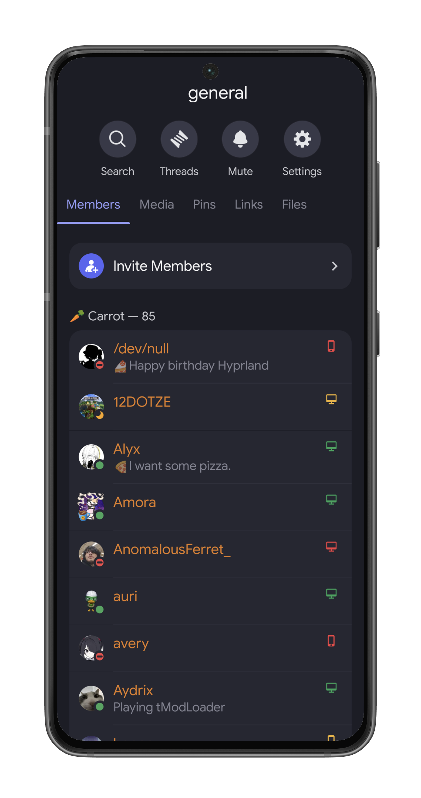
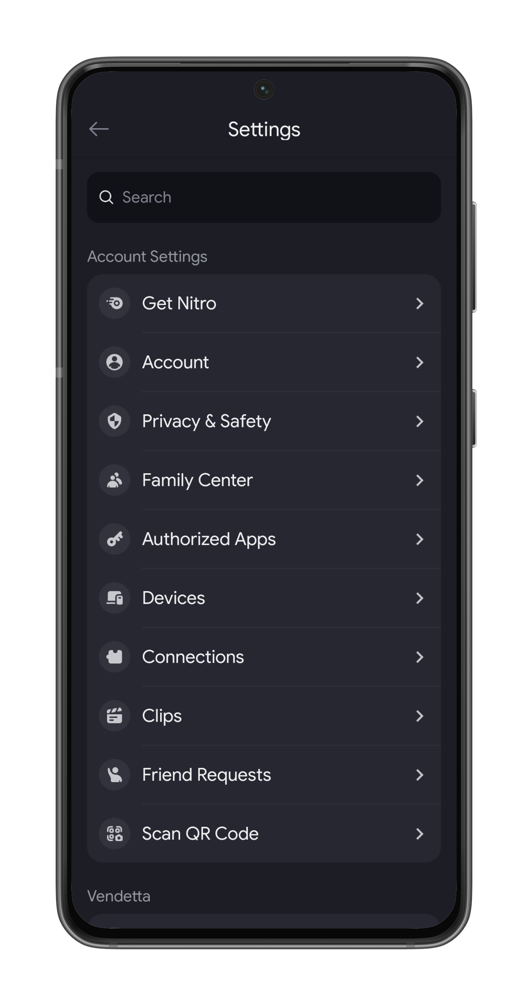
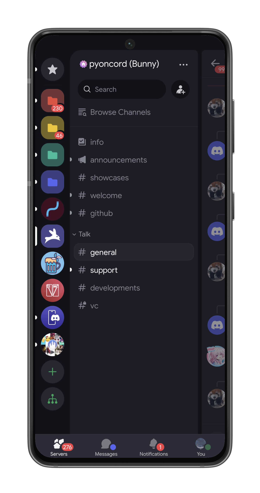
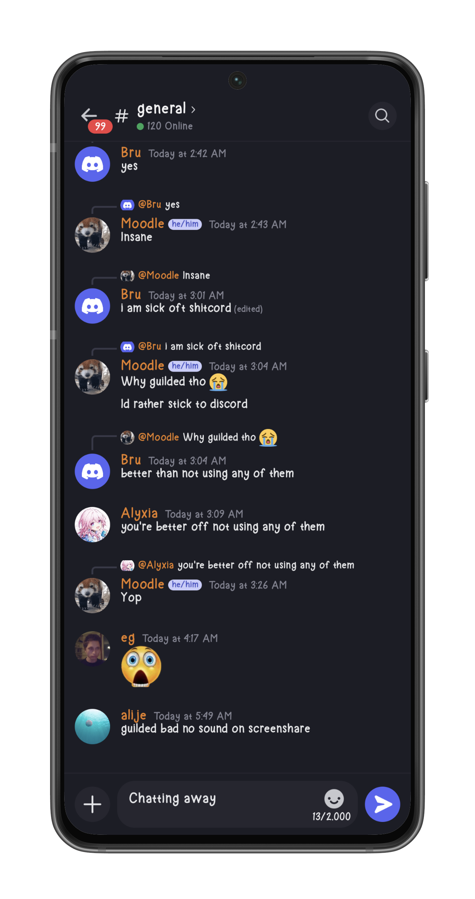
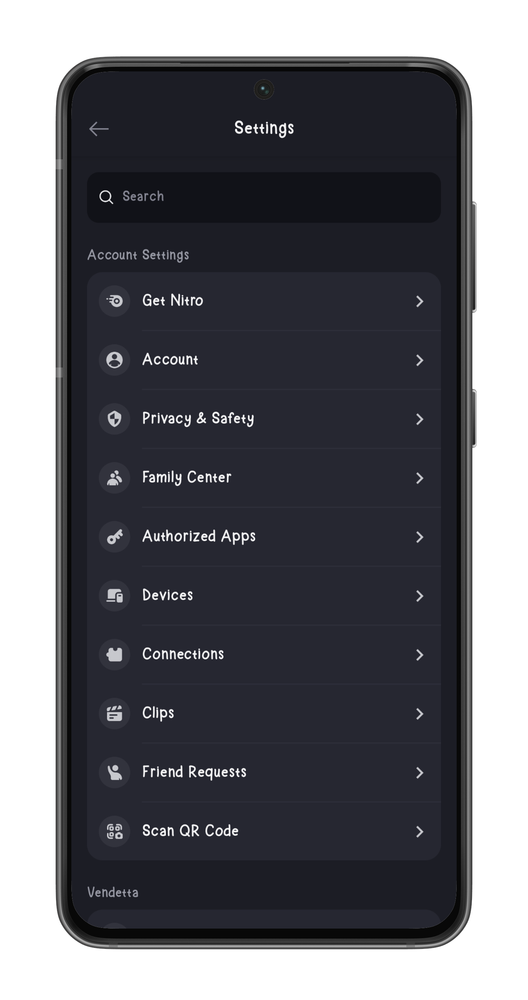

    
    <h1 align="center">Fonts for Discord</h1>

A shrimple Discord Font repository for themers who wants to use custom fonts in their themes.

All Fonts will be provided in here along with a Gallery section that will showcase each fonts in a neat & organised manner.

<h1 align="left">Implementation-</h1>

Implementing fonts in a discord theme for mobile is pretty easy and straightforward, here is how to do it:

>Please refer to [this guide](https://docs.riichi.tech/objects/raw-colors) how on to make a theme for mobile discord, currrently [Bunny](https://github.com/pyoncord/Bunny), [Revenge](https://github.com/revenge-mod) & [Vendetta (EOL)](https://github.com/vendetta-mod) supports theming. More discord client mod support will be added Meloso in future when they releases...
### Prerequisites:
>You need to have a `.json` file for your themes to work on mobile discord `(this method dosent work on PC/web discord)`. Open the `.json` file in your preferred editor, I use windows notepad, you can use notepad too if you are not sure what to use.
# Adding font code snippet into your .json file: 
>## Method 1- 
>## Just copy/paste the [code snippet](https://github.com/Rairof/Theme-Fonts/blob/main/assets/Code-snippet) provided in this repository into your `.json` file at the end of your [rawcolour strings](https://docs.riichi.tech/objects/raw-colors) i.e, just below these highlighted strings-
>
>### Then, replace the `Font-Name` within all the links provided in the snippet with the font you want from the repository and save changes.
>## NOTE-
>### Please ensure correct font names are replaced along with the link directory to said font files in the repository for the fonts to work, otherwise yout theme will cause unwanted crashes.
>## Method 2-
>### Just copy & paste the code snippet provided at the end of each theme pictures in Gallery section into your `.json` in the same position as `Method 1`states i.e at the end of your [rawcolour strings](https://docs.riichi.tech/objects/raw-colors). 
---
<h1 align="center">Gallery</h1>
<h2 align="left">1. BlowBrush</h2>

>[!NOTE]
>BlowBrush font doesn't seem to have a family tree like other fonts hence all theme makers are advised to use the given theme file for all types of fonts in their themes, let me know if you find any family tree for this font. Font sourced from [here.](https://www.dafont.com/blowbrush.font)
<h2 align="left">2) GoogleSans</h2>

# [Font Snippet](https://github.com/Rairof/Theme-Fonts/blob/main/GoogleSans/GoogleSans-Font-snippet)
## Font sourced from [here.](https://github.com/hprobotic/Google-Sans-Font/tree/master)
<h2 align="left">3) Evolve Sans EVO</h2>

# [Font Snippet](https://github.com/Rairof/Theme-Fonts/blob/main/Evolve-Sans-EVO/Evolve-Sans-EVO-font-snippet)
## Font sourced from [here.](https://www.dafont.com/made-evolve-sans.font)
<h2 align="left">4) Witcher Handwriting</h2>

# [Font Snippet](https://github.com/Rairof/Theme-Fonts/blob/main/Witcher-Handwriting/Witcher-Handwriting-font-snippet)
## Font sourced from [here.](https://www.fontspace.com/witcher-handwriting-font-f50757)
<h2 align="left">4) Meloso</h2>

# [Font Snippet](https://github.com/Rairof/Theme-Fonts/blob/main/Meloso/Meloso-font-snippet)

## Font sourced from [here.](https://www.ios-repo-updates.com/repository/alo-s-repo/package/works.alo.fonts.meloso80/)
